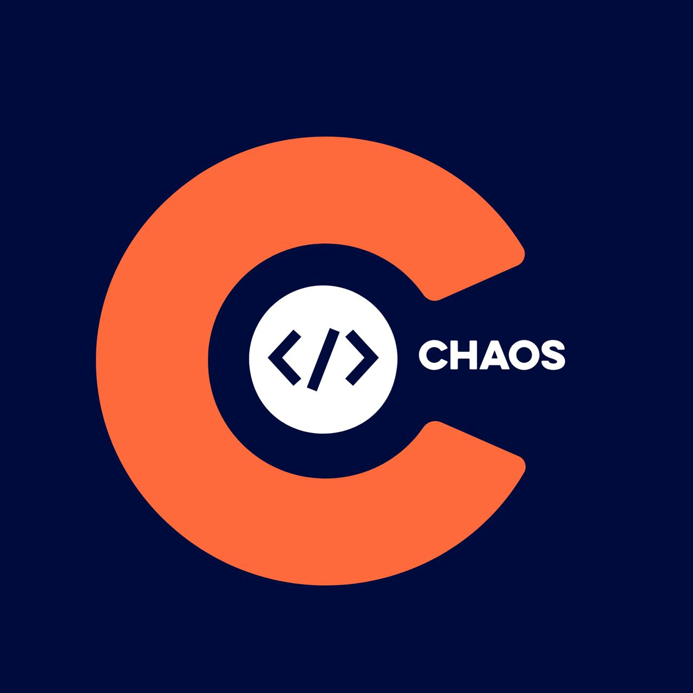

<p align="center">
  
</p>

<h1 align="center">CodeChaos</h1>

<p align="center">
  <a href="https://github.com/TheCodeChaos/thecodechaos.github.io/actions/workflows/code-quality.yml"></a>
  <a href="https://github.com/TheCodeChaos/thecodechaos.github.io/actions/workflows/publish.yml"></a>
  <a href="LICENSE"></a>
  
  
</p>

Official website for **CodeChaos** — an open coding club for students focused on building, collaborating, and shipping real software.

Live: https://thecodechaos.github.io/

## Stack

- Astro 6, TypeScript
- ESLint + Prettier for linting and formatting
- `@astrojs/rss` and `@astrojs/sitemap` for the feed and sitemap
- Pagefind for on-site search
- `@resvg/resvg-js` for generated OG images
- GSAP and AOS for animations

## Develop

```sh
npm install
npm run dev
```

Content lives in `src/content/` — `blog/` for posts and `members/` for the member directory.

## Validate

Run every quality check in one go before pushing:

```sh
npm run validate
```

This runs, in order:

| Check      | Command                |
| ---------- | ---------------------- |
| Formatting | `npm run format:check` |
| Linting    | `npm run lint`         |
| Types      | `npm run typecheck`    |
| Build      | `npm run build`        |

`npm run format` auto-fixes formatting. `npm run validate:static` runs everything except the build.

## Build

```sh
npm run build
```

Output goes to `dist/` (search indexing runs automatically after build via Pagefind). The base path can be set with the `BASE_PATH` env var so the same build deploys under any path.

## CI & Deploy

- **Code Quality** (`.github/workflows/code-quality.yml`) runs on every push and pull request — type check, lint, format check, build, and a security audit — and posts a pass/fail summary on the PR.
- **PR Preview** (`.github/workflows/preview.yml`) validates and deploys each pull request to its own preview URL under `/pr-previews/<number>/`.
- **Deploy** (`.github/workflows/publish.yml`) validates and publishes `dist/` to the `gh-pages` branch on every push to `main`.

A change must pass validation before it can be previewed or deployed.

## Contributing

Open a pull request — it gets a live preview and a Code Quality report automatically. Please run `npm run validate` locally first so the checks pass on the first try.

## License

MIT, © 2026 Shravan Goswami ([shravangoswami.com](https://shravangoswami.com) · [@shravanngoswamii](https://github.com/shravanngoswamii)). See [LICENSE](LICENSE).
